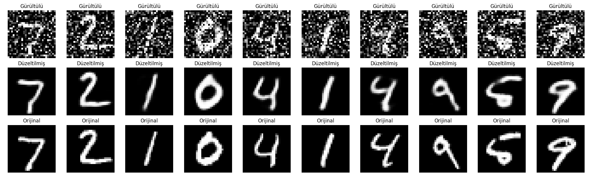
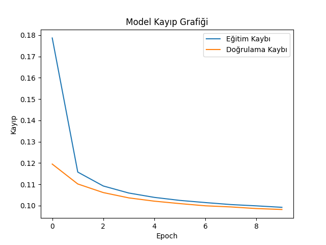
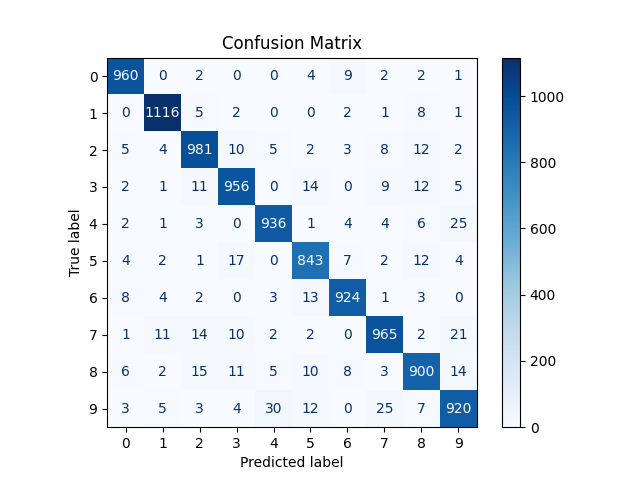

# Denoising Autoencoder ile Gürültülü Görüntü Temizleme ve Özellik Tabanlı Sınıflandırma

Bu projede, MNIST el yazısı rakam veri seti üzerinde, gürültülü görüntüler Denoising Autoencoder (DAE) kullanılarak temizlenmiş ve elde edilen temsiller üzerinden makine öğrenmesi ile sınıflandırma gerçekleştirilmiştir.

---

## Giriş

Görüntü işleme alanında gürültü, model başarımını olumsuz etkileyen başlıca sorunlardan biridir. Autoencoder mimarileri, verinin düşük boyutlu temsillerini öğrenerek gürültüden arındırma ve yeniden yapılandırma işlemlerinde yaygın olarak kullanılmaktadır. Bu çalışmada, MNIST veri setine rastgele gürültü eklenmiş ve Denoising Autoencoder ile temizlenmiştir. Daha sonra, elde edilen temsiller lojistik regresyon modeli ile sınıflandırılmıştır.

---

## Yöntem

### Veri Seti:
- **MNIST** (28x28 gri ölçekli el yazısı rakamlar)
- 60.000 eğitim, 10.000 test örneği

### Gürültü Ekleme:
- Normal dağılımdan rastgele gürültü eklendi
- Gürültü oranı: `0.5`
- `np.random.normal()` kullanılarak simüle edildi

### Model Mimarisi (DAE):
- Encoder:
  - 2 adet `Conv2D + MaxPooling2D` bloğu
- Decoder:
  - 2 adet `Conv2D + UpSampling2D` bloğu
- Aktivasyonlar: `ReLU`, `sigmoid`
- Kayıp fonksiyonu: `binary_crossentropy`
- Optimizasyon: `Adam`
- Eğitim süresi: `10 epoch`

### Özellik Tabanlı Sınıflandırma:
- Autoencoder’ın encoder kısmı ile temsiller (features) çıkarıldı
- Lojistik regresyon modeli ile sınıflandırma yapıldı
- Eğitim ve test verileri **ayrı encoder geçişleri ile** işlendi

---

## Sonuçlar

### Görsel Örnekler

Aşağıda sırasıyla gürültülü giriş, autoencoder tarafından düzeltilmiş çıkış ve orijinal görüntü yer almaktadır:

---

### Kayıp Grafiği

Eğitim ve doğrulama kaybı dengeli şekilde düşmüş ve overfitting gözlemlenmemiştir:

---

### Confusion Matrix

Modelin sınıflandırma sonuçları:

---

### Classification Report

| Class | Precision | Recall | F1-Score | Support |
|-------|-----------|--------|----------|---------|
| 0     | 0.97      | 0.98   | 0.98     | 980     |
| 1     | 0.98      | 0.99   | 0.98     | 1135    |
| 2     | 0.95      | 0.95   | 0.95     | 1032    |
| 3     | 0.95      | 0.94   | 0.94     | 1010    |
| 4     | 0.95      | 0.96   | 0.95     | 982     |
| 5     | 0.94      | 0.96   | 0.95     | 892     |
| 6     | 0.97      | 0.97   | 0.97     | 958     |
| 7     | 0.95      | 0.94   | 0.95     | 1028    |
| 8     | 0.93      | 0.93   | 0.93     | 974     |
| 9     | 0.94      | 0.91   | 0.93     | 1009    |

|       | Precision | Recall | F1-Score | Support |
|-------|-----------|--------|----------|---------|
| **Accuracy**   |       |        | 0.95     | 10000  |
| **Macro Avg**  | 0.95  | 0.95   | 0.95     | 10000  |
| **Weighted Avg** | 0.95  | 0.95   | 0.95     | 10000  |

F1-score değerleri çoğu sınıf için %94-98 aralığında olup modelin oldukça başarılı sonuçlar verdiği görülmektedir.

---

## Tartışma

Bu proje kapsamında Denoising Autoencoder mimarisi, görsel veri üzerinde başarılı bir şekilde gürültü giderme ve temsil öğrenme işlemi yapmıştır. Modelin başarısı hem görsel çıktılarla hem de sınıflandırma metrikleriyle doğrulanmıştır. Özellikle veri sızıntısı yapılmadan yapılan sınıflandırma, modelin genel geçer performansını doğru şekilde yansıtmaktadır.

Gelecekte:
- Daha karmaşık veri setleri (Fashion-MNIST, CIFAR-10)
- Daha derin autoencoder mimarileri
- Farklı makine öğrenmesi algoritmaları

kullanılarak çalışma genişletilebilir.

---

## Referanslar

1. LeCun, Y., Bottou, L., Bengio, Y., & Haffner, P. (1998). Gradient-based learning applied to document recognition.
2. https://keras.io/
3. https://scikit-learn.org/
